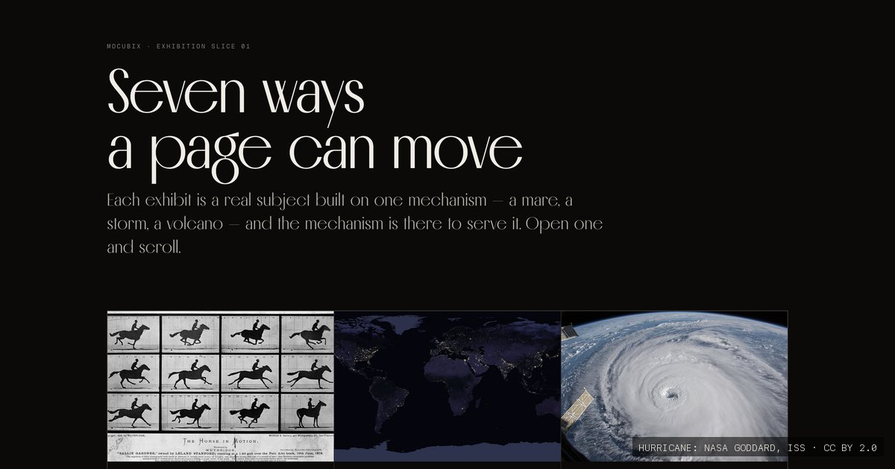
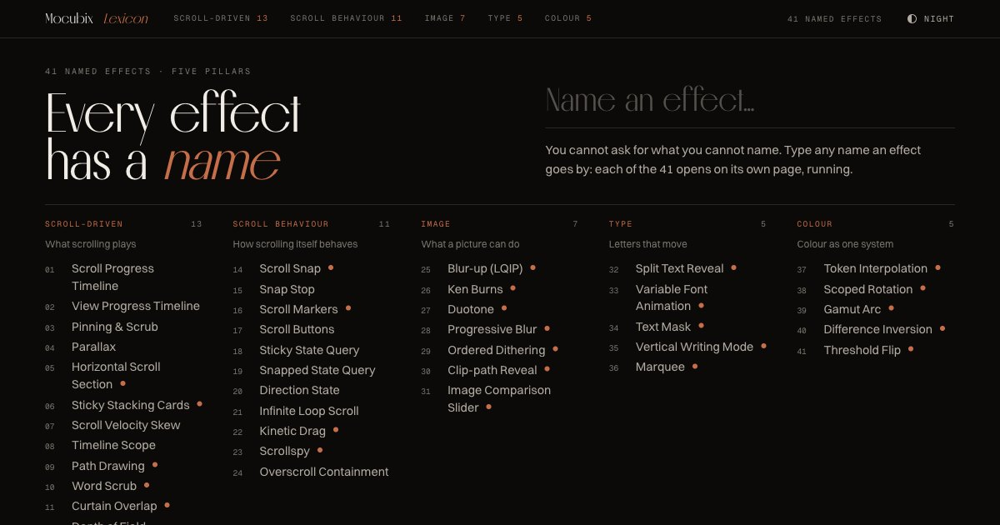

# Mocubix

**Seven ways a page can move, and a lexicon of 41 named interface effects, each one running on real material.**

**https://mocubix.renocrypt.com/**

[](https://mocubix.renocrypt.com/)
[](https://github.com/renocrypt/mocubix/actions/workflows/pages.yml)
[](https://mocubix.renocrypt.com/lexicon/)
[](AGENTS.md)
[](AGENTS.md)

[](https://mocubix.renocrypt.com/)

## The exhibits

Each exhibit is a real subject built on one mechanism, and the mechanism is there to serve it. Open one and scroll.

- **01 · [Annie G.](https://mocubix.renocrypt.com/annie-g/)** — Sixteen frames of a galloping mare, from Muybridge, 1887. Scroll and she runs; scroll back and she runs backwards. Your place on the scrollbar is the frame.
- **02 · [Night side](https://mocubix.renocrypt.com/night-side/)** — Eight night passes of the space station, laid end to end in the one direction it flies. Scroll down and the window moves sideways while the station crosses a map of the Earth at night.
- **03 · [Throw the page](https://mocubix.renocrypt.com/florence/)** — Three minutes over Hurricane Florence, 2018. Where you are decides what you see; how fast you move is read on the hurricane scale. Throw the page and the storm turns.
- **04 · [Urformen](https://mocubix.renocrypt.com/urformen/)** — Nine of Blossfeldt's magnified plants, 1928, each print developing on its own clock as it passes. The page has no single beat.
- **05 · [Departures](https://mocubix.renocrypt.com/departures/)** — An evening at Secaucus Junction on the split-flap boards that still hang there. Trains board and leave whether you move or not, one flap at a time.
- **06 · [Orrery](https://mocubix.renocrypt.com/orrery/)** — A true orrery: every planet where it is today, running at its real pace. Pull it apart into its layers without stopping it.
- **07 · [Kīlauea, in four phases](https://mocubix.renocrypt.com/kilauea/)** — An eruption in four phases with a live observatory panel, from the Hawaiian Volcano Observatory, 2018. At each break the whole screen changes state at once.

## The Lexicon

[](https://mocubix.renocrypt.com/lexicon/)

You cannot ask for what you cannot name. The Lexicon is 41 named interface effects in five pillars (scroll-driven, scroll behaviour, image, type and colour), each on its own page with the names practitioners use for it and how it is built. One by one, the term pages are growing into full showcases, each on its own body of public-domain material: Hiroshige's *One Hundred Famous Views of Edo*, Minard's map of the 1812 campaign, the greetings of the Voyager Golden Record, Seurat's *Grande Jatte*, Runge's colour sphere.

https://mocubix.renocrypt.com/lexicon/

## How it is built

- Plain HTML and CSS in `site/`, with a few small scripts, no framework and no dependencies. What Chrome does natively is the exhibit: scroll-driven animations, scroll-triggered animations, `@property`, view transitions, `corner-shape`.
- Every word ships as real text in the served HTML, so search engines and AI crawlers read the whole site.
- The material comes from Wikimedia Commons, public domain or openly licensed, and each page credits its sources.
- Made for Chrome, and checked in it at desktop and phone widths.
- GitHub Actions publishes `site/` to GitHub Pages on every push to `main` that touches it.

## Run it locally

```sh
python3 build/serve.py
```

Then open http://127.0.0.1:8765/.

## Working on it

Start with [AGENTS.md](AGENTS.md): the laws, the map of the repository and the build tools. [notes/NEXT.md](notes/NEXT.md) says what comes next, [notes/TRAPS.md](notes/TRAPS.md) lists the traps already met, and [notes/DECISIONS.md](notes/DECISIONS.md) keeps the history of every exhibit and showcase.
